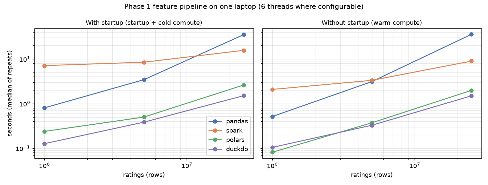

<!-- Generated by scripts/write_readme.py from README.template.md and results/*.csv.
     Edit the template, then run `make readme`. `make readme-check` (also in CI) fails
     if this file and the results disagree. -->
# CineInfer

A movie recommender trained on 25,000,095 MovieLens ratings: given a user, it returns the 10
movies they're most likely to rate 4 stars or higher. It's built as a two-stage system (a PyTorch
two-tower retriever picks 200 candidates from 62,423 movies; a LightGBM ranker re-orders
them) and served by a FastAPI endpoint.

The point of the project is honest measurement. Every model is compared with four baselines
tuned as hard as the neural models, the test slice was scored exactly once, and
[seven predictions](#predictions-committed-before-training) were committed and pushed
([`predictions` tag](https://github.com/spoigai21/cine-infer/tree/predictions)) before any neural model was trained. Five of them
turned out wrong. **Every result in this README is generated from `results/*.csv`**
(`make readme`), and CI fails if they drift apart (`make readme-check`).

> Demo video: *coming in Phase 11.*

## Results (test slice, scored once)

153,995 users, each ranking against the full catalog with everything they'd already rated
masked. A movie counts as relevant if the user rated it ≥ 4 in their held-out test period.

| Model | NDCG@10 | Recall@10 (capped) | AUC | Coverage | Runs |
|---|---|---|---|---|---|
| **Two-stage (headline)** | 0.1679 | 0.2028 | 0.989 | 11.4% | 3 (median) |
| Two-tower (retrieval) | 0.1382 | 0.1723 | 0.989 | 16.4% | 3 (median) |
| EASE | 0.1211 | 0.1482 | 0.976 | 5.7% | deterministic |
| EASE, recent-10 input (control) | 0.1184 | 0.1463 | 0.965 | 7.4% | deterministic |
| Implicit ALS | 0.1165 | 0.1429 | 0.948 | 5.3% | 3 (median) |
| Item-kNN | 0.0956 | 0.1168 | 0.984 | 7.3% | deterministic |
| Most-popular | 0.0513 | 0.0617 | 0.977 | 0.6% | deterministic |

- **The two-stage system beats every baseline**: +38.5% NDCG@10 over
  the best baseline, EASE (+0.0466, 95% CI [+0.0458, +0.0475],
  paired bootstrap over users).
- **The ranker adds +21.2%** over retrieval alone
  (+0.0294, CI [+0.0288, +0.0299]). It can only
  re-order what retrieval found: 64.6% of relevant test movies are in the
  200 candidates.
- **The two-tower model beats EASE by +14.3%**
  (+0.0173, CI [+0.0162, +0.0183]) and recommends
  2.9× as much of the catalog (16.4% vs 5.7% of the
  55,119 movies with training data).
- Paired bootstrap on NDCG@10, Two-stage (headline) > Two-tower (retrieval) > EASE > Implicit ALS > Item-kNN > Most-popular: every step is statistically clear (`results/test_gaps.csv`).

### Where the gains come from

MovieLens timestamps are *rating* time, and users rate in bursts: 70.7% of users rated
their whole test slice within one hour (median span 4 minutes). So under a
per-user time split, the "future" is usually the rest of the same sitting. Breaking test results
down by the gap between a user's last training rating and their first test rating:

| Test NDCG@10 by gap between last train/val rating and first test rating | same second (27,032 users) | within 1 h (119,046 users) | over 1 h (7,917 users) | all (153,995 users) |
|---|---|---|---|---|
| EASE | 0.1359 | 0.1176 | 0.1242 | 0.1211 |
| EASE, recent-10 input (control) | 0.1528 | 0.1113 | 0.1074 | 0.1184 |
| Two-tower (retrieval) | 0.2004 | 0.1271 | 0.0980 | 0.1384 |
| **Two-stage (headline)** | 0.2283 | 0.1563 | 0.1339 | 0.1678 |

The two-tower model uses only a user's last 10 liked movies, so it's excellent at "what comes next
in this session" (0.2004 vs EASE's 0.1359) and
**worse than EASE when the test period starts more than an hour later**
(0.0980 vs 0.1242). That isn't just a short input
window: feeding EASE only the last 10 movies (the control row) doesn't reproduce it. The ranker
sees both scores and learns when to trust each, so the two-stage system beats EASE in every
bucket, including over 1 h (0.1339).

### Ranker ablations

| System (test) | NDCG@10 | vs headline (95% CI) |
|---|---|---|
| Two-stage + time features (ablation, not used) | 0.1745 | +0.0063 [+0.0061, +0.0065] |
| **Two-stage (headline)** | 0.1679 | — |
| Two-stage without EASE features (ablation) | 0.1480 | -0.0200 [-0.0204, -0.0195] |
| Two-tower (retrieval) | 0.1382 | -0.0294 [-0.0299, -0.0288] |

- **EASE's score is the ranker's most valuable feature.** Without it the ranker keeps only
  33% of its gain over retrieval.
- **Two time features are excluded** even though they help. They compare a user's last rating
  with the last time *anyone* rated a movie, and under a per-user split "anyone" includes other
  users' ratings from after this user's cutoff: information a live system wouldn't have.

## Predictions (committed before training)

2 of 7 confirmed, 5 refuted.
Each was written with a "refuted if" condition, committed, tagged and pushed before any neural
model existed, and is settled by code from the result files, never by hand.

| # | Prediction (committed before training) | Verdict | Evidence |
|---|---|---|---|
| 1 | Two-tower beats most-popular on NDCG@10 by at least 50% (relative). | ✅ confirmed | two_tower/most_popular NDCG@10 = 2.694 (needs >= 1.5) |
| 2 | EASE matches or beats two-tower on Recall@10; two-tower within 10% of EASE. | ❌ refuted | (EASE - two_tower)/EASE Recall@10 = -0.163; two_tower - EASE = +0.0244 [+0.0230, +0.0256] |
| 3 | Ranking stage changes NDCG@10 over retrieval alone by -1% to +5% (relative); refuted if > +5% or significantly below -1%. | ❌ refuted | (two_stage - two_tower)/two_tower NDCG@10 = +0.215; diff +0.0293 [+0.0288, +0.0299] |
| 4 | Most-popular has the lowest catalog coverage of all models. | ✅ confirmed | most_popular 0.0059 vs lowest other 0.0530 (implicit_als) |
| 5 | pandas beats PySpark on the Phase 1 feature pipeline at 1M, 5M and 25M rows, with and without Spark startup: no crossover. | ❌ refuted | 1M with startup: pandas 0.80s vs spark 7.10s; 1M without startup: pandas 0.51s vs spark 2.08s; 5M with startup: pandas 3.44s vs spark 8.46s; 5M without startup: pandas 3.11s vs spark 3.32s; 25M with startup: pandas 34.93s vs spark 15.59s; 25M without startup: pandas 35.57s vs spark 8.95s |
| 6 | Serving p99 < 25 ms and p50 < 10 ms for top-10 (two-tower + ranker, 1,000 sequential HTTP requests after 50 warm-up). | ❌ refuted | two-stage client p50 5.23 ms (needs < 10), p99 28.51 ms (needs < 25); 1,000 sequential HTTP requests after 50 warm-up, power AC |
| 7 | Random split overstates NDCG@10 vs the global cutoff by at least 50%; ordering random > per-user > global (EASE). | ❌ refuted | EASE test NDCG@10: random 0.3359, per-user 0.1211, global 0.1482; random/global = 2.27 (95% CI 2.17-2.37; needs >= 1.5); order random > global > user |

What the refutations say:
- **#2, #3:** I expected a well-tuned EASE to match the neural model and the ranker to add little.
  Both gains are real, but the boundary table shows much of the two-tower's comes from predicting
  the rest of a rating session.
- **#5:** local-mode Spark's overhead dominates at 1M and 5M rows, but single-threaded pandas scales
  worse, and Spark wins at 25M. DuckDB and Polars beat both at every size.
- **#6:** the typical request was fast, but the p99 missed the target by 3.5 ms.
- **#7:** the random split inflates NDCG@10 even more than predicted, but the global cutoff scored
  *above* the per-user split: its 3,992 test users are the heavy raters still
  active after January 2018, a different population.

## How the split choice changes the numbers

Same model (EASE, same config) and same metric, three ways to split the data:

| Split (EASE, same config) | Test users | NDCG@10 (95% CI) | × global |
|---|---|---|---|
| Random 80/10/10 | 148,766 | 0.3359 (0.3345–0.3373) | 2.27 |
| Per-user time split (the project's) | 153,995 | 0.1211 (0.1202–0.1221) | 0.82 |
| Global time cutoff | 3,992 | 0.1482 (0.1415–0.1547) | 1.00 |

A random split lets the model train on a user's *later* ratings and test on earlier ones; it
reports 2.27× (95% CI 2.17–2.37) the global cutoff's NDCG@10. This project
uses the per-user time split for everything else: no user's own future leaks into their
training data, and it keeps 153,995 users evaluable (the global cutoff keeps
3,992).

## Serving

`GET /recommend/{user_id}?k=10` retrieves 200 candidates by brute-force dot product over all
62,423 movies, builds 15 features, ranks with LightGBM and returns titles, scores and
per-stage timings. Unknown users get the most-popular list. The server is NumPy + LightGBM only
(no PyTorch) and loads the model bundle in 2 s.

- **No training/serving skew:** on 2,000 test users, the server's top-10 matches the
  batch pipeline's for 100%.
- **Latency (1,000 sequential HTTP requests, laptop CPU):** the run that settled prediction #6
  measured p50 5.2 ms and p99 28.5 ms (target < 25 ms: refuted).
  Afterwards, and reported separately, single-threaded serving removed contention between the
  libraries' thread pools: p50 3.2 ms, p99 6.8–19.3 ms
  (default threading: p99 25–60 ms). The popularity fallback takes
  0.4 ms.

## Retraining with Airflow

An Airflow DAG runs prep → train → evaluate → **publish only if better** than the live model:
validation NDCG@10 must beat it by more than 0.003, just above the measured run-to-run
noise, so a plain retrain can't win by chance. Publishing refits on train + val, rebuilds the
ranker, exports and smoke-tests a bundle, then swaps the served bundle atomically.

- **Refusal (the deliverable):** a deliberately worse 1-epoch model (validation
  NDCG@10 0.1396 vs live 0.1538) was rejected, and publish was skipped
  (`results/airflow_reject_demo.txt`).
- **Publish, end to end on real data:** in a sandbox registry whose live model is that 1-epoch
  model, a tuned candidate (0.1526 vs 0.1396) was published and
  served, with the production registry left byte-identical (`results/airflow_publish_demo.txt`).

## pandas vs Spark vs Polars vs DuckDB

The Phase 1 data pipeline (per-user split and features), implemented four ways with identical
outputs, timed in fresh processes (36 runs, on AC power, load ≤ 3.0).
Each cell is *with startup / without startup* (warm compute), median of 3:

| Rows | pandas | Spark (6 cores) | Polars | DuckDB |
|---|---|---|---|---|
| 1,000,379 | 0.80 / 0.51 s | 7.10 / 2.08 s | 0.24 / 0.08 s | 0.13 / 0.10 s |
| 5,001,313 | 3.44 / 3.11 s | 8.46 / 3.33 s | 0.50 / 0.37 s | 0.39 / 0.33 s |
| 25,000,095 | 34.93 / 35.57 s | 15.59 / 8.95 s | 2.61 / 1.98 s | 1.50 / 1.50 s |



## How it was built

| Phase | What |
|---|---|
| 0–1 | Download with checksums; PySpark per-user time split (checked for zero leakage); features from train only |
| 2 | Evaluation harness: full-catalog ranking, seen-item masking, deterministic ties, bootstrap CIs |
| 3 | Four baselines tuned on validation (grids extend past edges; every trial logged) |
| 4 | Predictions committed, tagged and pushed |
| 5–6 | Two-tower retriever (PyTorch, Apple GPU) and LightGBM ranker, tuned on validation, 3 seeds |
| 6b | Every model refit on train + val and scored on test **once** (sealed results) |
| 7–9 | Serving, Airflow retraining gate, engine benchmark |

Tuning, on 151,597 validation users (test was never used for any choice):

| Model | Validation NDCG@10 | Chosen config | Trials | Tuning time |
|---|---|---|---|---|
| Most-popular | 0.0528 | — | 1 | 2 s |
| Item-kNN | 0.0976 | k=200, min_pos=20, shrink=0.0 | 8 | 42 s |
| EASE | 0.1193 | lam=1000.0, min_pos=20 | 12 | 4 min |
| Implicit ALS | 0.1153 | alpha=1.0, rank=256, reg=0.1 | 19 | 1.4 h |
| EASE, recent-10 input (control) | 0.1224 | lam=4000.0, min_pos=20, recent_n=10 | 14 | 2 min |
| Two-tower (retrieval) | 0.1531 | dim=256, epochs=6, hist_len=10, lr=0.009, pairs_per_user=100, tau=0.05 | 19 | 2.7 h |
| **Two-stage (headline)** | 0.1784 | learning_rate=0.02, min_data_in_leaf=6, num_leaves=63, rounds=123 | 10 | 4 min |

## Running it

Requirements: macOS or Linux, Python 3.11, **Java 17** for Spark, `brew install libomp` on macOS
for LightGBM, ~15 GB free disk.

```bash
make install        # .venv with everything
make data           # download + verify MovieLens 25M (not redistributable, never committed)
make prep           # Phase 1: splits + features (~2 min)
make baselines      # Phase 3: tune the baselines on validation (~1.5 h, mostly ALS)
make two-tower      # Phase 5: tune the retriever (~3 h on an Apple GPU)
make ranker         # Phase 6: two-stage system on validation (~45 min)
make final-test     # Phase 6b: refit everything, score test once (~1.5 h)
make export serve   # Phase 7: build the serving bundle, run the API on :8000
make airflow-install airflow-reject-demo   # Phase 8
make benchmark      # Phase 9 (plug in, idle machine)
make split-comparison test-analysis readme  # Phase 10
make test           # the test suite, on a synthetic fixture (also in CI)
```

Times are rough guides for one laptop. Run one pipeline at a time: several steps use most of the CPU, and timing steps check the load.

## Limitations

- **Offline metrics only.** There's no A/B test, and no real users.
- **Timestamps are rating time, not watch time**, and most "future" ratings belong to the same
  sitting as the training data (the boundary table). The headline gains are largest there.
- **No cold-start users:** every MovieLens user has ≥ 20 ratings. The fallback path is designed
  and tested, not validated on real traffic. 7,852 movies appear only in val/test and
  can't be recommended by any model.
- **Cross-user time leakage under the per-user split:** a 2008 test rating is predicted by models
  that saw other users' 2015 ratings. The ranker's time features were excluded for this reason;
  popularity-based features still carry some of it.
- **The tag genome was computed by GroupLens in 2019 from all the data**, so ranker features built
  from it carry some post-cutoff information (only 13,816 movies have one).
- **Compute caps:** ALS rank and the two-tower embedding size were capped at 256; EASE and
  item-kNN use only movies with ≥ 20 training positives.
- **One machine:** latency is one client on a laptop; the Spark benchmark is local mode.
- **Results are specific to MovieLens.**

## Repository map

`src/` pipeline code (data prep, evaluation harness, models, serving, retraining) · `tests/` pytest
on a synthetic fixture · `results/` every number above, as CSV · `dags/` Airflow ·
`cineinfer.md` the plan and predictions · `cineinfer-implementation.md` the build log, phase by
phase. Data: [MovieLens 25M](https://grouplens.org/datasets/movielens/25m/) (GroupLens; downloaded
by `make data`, not redistributed).
